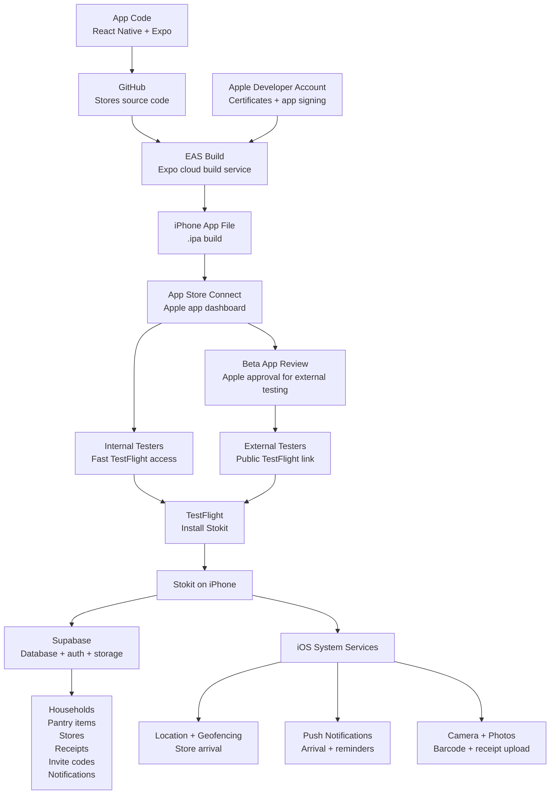

# Stokit App Architecture Flowchart

## Simple Flow

1. Code is pushed to GitHub.
2. EAS builds the app using Apple signing.
3. EAS sends the `.ipa` file to App Store Connect.
4. App Store Connect sends it to TestFlight.
5. Testers install Stokit from TestFlight.
6. The installed app talks to Supabase and iOS services.
